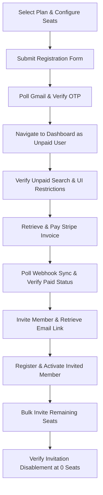

# E2E Test Documentation: Master Expert Registration Flow (Dynamic)

This document provides execution details, step-by-step logic, and architectural insights for the dynamic registration flow test suite: `full_registration_expert_flow_dynamic.spec.js`.

---

## 🚀 Execution Details

The test is fully customizable via environment variables, allowing you to simulate different seat counts and search goal configurations without altering the test code.

### Environment Parameters
* **`FA`** *(number, required)*: Total Full Access seats requested (minimum: 5).
* **`RO`** *(number, required)*: Total Read-Only seats requested.
* **`GOALS`** *(comma-separated strings, required)*: List of search goal codes to select (e.g. `FC` for Fuzzy Match, `PM` for Pattern Match).

### How to Run

Run in headful/headless mode inside the Playwright workspace:

```bash
# Run with custom parameters (e.g. 10 Full Access, 7 Read-Only, and specific search goals)
FA=10 RO=7 GOALS=FC,PM npx playwright test tests/specs/flow/full_registration_expert_flow_dynamic.spec.js
```

---

## 🧠 Core Test Logic

The script simulates a comprehensive E2E customer journey through the following sequence:



### 1. Subscription Selection
* Loads the subscription config screen (resilient to Next.js chunk loaders using a retry mechanism).
* Selects the **Expert** plan.
* Increments/decrements the Full Access and Read-Only seats dynamically to match `FA` and `RO` params.
* Verifies the Grand Total dynamically aligns with pricing updates.

### 2. OTP & Registration Verification
* Fills out the company signup form using the standard format:
  * **Company Name Prefix:** `Ankit QA AT`
  * **Email:** `ankitqa.iihglobal+*****@gmail.com` (using random UUID strings to avoid collisions).
  * **Password:** `Pa$$w0rd!`
* Triggers OTP delivery, polls the Gmail inbox via IMAP, decodes the OTP, and registers the account.

### 3. Verification of Unpaid State Restrictions
Before billing completes, the user is redirected to the portal. The test asserts the following safety restrictions are active:
* **UI Tabs:** Only *Subscription* and *Payment History* tabs are visible.
* **Search Restrictions:** Query search and CSV uploads are disabled, displaying the unpaid license warning.
* **Toolbar Actions:** The "Invite Member" button is disabled.

### 4. Stripe Checkout Payment
* Polls the registered email account for the Stripe invoice delivery.
* Extracts the secure payment link, opens a new isolated tab, and fills in mock credit card details (Stripe Test Suite configuration).
* Executes the payment workflow.

### 5. Transition to Paid State & Webhook Verification
* Returns to the WebApp dashboard.
* Uses reload-polling to wait for the asynchronous Stripe backend webhook to sync.
* Verifies status updates from `UNPAID` to `RENEWABLE` / `ACTIVE`.
* Asserts the unpaid license warning has disappeared and the search toolbar is fully functional.

### 6. Seat Consumption & Active Member Registration Loop
* Switches to the *Users* tab.
* Dynamically loops to invite, retrieve invitation links from Gmail, register, complete profile, verify via OTP, and activate **all** available Full Access and Read-Only members.
* For every invited user, the test:
  * Polls Gmail to retrieve the invitation email containing the subject `${company_name} Invited`.
  * Extracts the unique invitation/registration token link.
  * Opens a separate unauthenticated tab context, navigates to the invitation URL, fills out the member profile name/password, and registers.
  * Polls Gmail for the Verification code (OTP) for the member, enters it, and completes registration.
  * Reloads the admin dashboard page, checking that the user status successfully transitioned from `Pending` to `Active` with their registered name.

### 7. Seat Overflow Prevention
* Once all seats are consumed and available seat counters reach `0`, the test opens the invitation modal and asserts that invitation controls for both Full Access and Read-Only are disabled, preventing seat overrun.

---

## 🛠️ Key Resilience Improvements

To prevent flakiness and handle timing gaps, we implemented the following stability enhancements:

1. **Navigation Retry Handler**: Built-in exponential backoff for `page.goto` navigations to eliminate failures caused by transient `net::ERR_ABORTED` network drops.
2. **Popover & Backdrop Safeguards**: Closes active dropdown popovers using `page.keyboard.press('Escape')` before interacting with underlying buttons to prevent `MuiBackdrop` element pointer interception errors.
3. **Success Modal Sync**: Configured `clickOkay()` to wait until the confirmation button state becomes `hidden`, ensuring all overlays clear out before initiating table validation.
4. **Dynamic Data Creation**: Generates random names/emails at runtime, preventing database collision failures.
