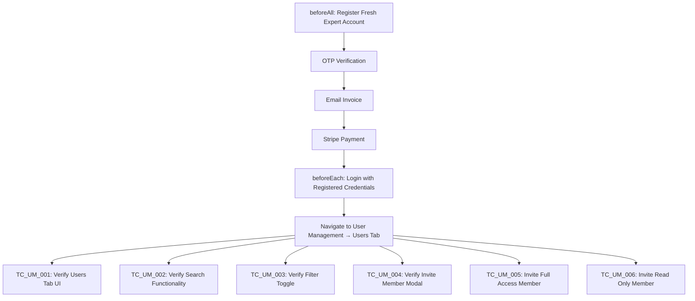

# E2E Test Documentation: User Management — Users Tab

This document provides execution details, step-by-step logic, and test case descriptions for the Users tab test suite: `user_management.spec.js`.

---

## 🚀 Execution Details

### How to Run

```bash
# Run full Users tab test suite
npx playwright test tests/specs/user_management.spec.js

# Run a specific test case
npx playwright test tests/specs/user_management.spec.js --grep "TC_UM_001"
```

### Pre-conditions
- No existing account needed — the suite registers a **fresh Expert account** in `beforeAll`.
- Stripe test environment must be accessible.
- Gmail IMAP credentials configured in `tests/data/register.data.json`.

### Account Configuration
| Parameter | Value |
|---|---|
| **Plan** | Expert |
| **Full Access Seats** | 5 (base) |
| **Read-Only Seats** | 1 |
| **Search Goals** | FC (Fuzzy Match) |

---

## 🧠 Core Test Logic



---

## ⚙️ Setup Flow

### `beforeAll` — Fresh Registration & Payment
Runs **once** before all tests. Registers a brand new Expert company account and completes Stripe payment so the Users tab is fully unlocked.

1. Navigates to the Subscription page (with retry logic).
2. Selects the **Expert** plan.
3. Adds **1 Read-Only seat** and selects **FC** search goal.
4. Fills the registration form with a unique random email (`ankitqa.iihglobal+<uid>@gmail.com`).
5. Polls Gmail for the **OTP** email and submits the verification code.
6. Clicks **Email Invoice and Pay**.
7. Polls Gmail for the **Stripe invoice** email and extracts the payment URL.
8. Opens Stripe hosted page in a new tab and completes payment with test card `4242 4242 4242 4242`.
9. Stores `registeredEmail`, `registeredPassword`, and `registeredCompanyName` for use in all tests.

### `beforeEach` — Login & Navigate
Runs before **each test**. Logs in with the registered credentials and navigates to the Users tab.

1. Navigates to the login page and logs in with the registered credentials.
2. Navigates to `/user-management`.
3. Polls the Subscription tab until status is no longer `Unpaid` (waits for Stripe webhook).
4. Switches to the **Users** tab.

### `afterEach` — Screenshot on Failure
If a test fails, a full-page screenshot is saved to:
```
test-results/screenshots/<TestCaseName>-failed.png
```

---

## 📋 Test Cases

### TC_UM_001: Verify Users Tab Renders All Expected Elements

- **Description**: Verify that the Users tab UI renders all expected toolbar controls, table structure, and column headers when a paid account navigates to the User Management page.
- **Pre-condition**: User is logged in with a paid Expert account and on the Users tab.
- **Steps**:
  1. Verify the **Users** tab is visible.
  2. Verify the **Search** input is visible.
  3. Verify the **Filter** button is visible.
  4. Verify the **Invite Member** button is visible and **enabled** (payment completed).
  5. Verify the data **table**, **thead**, and **tbody** are visible.
  6. Verify column headers: **Name**, **Email**, **Role**, **Action**.
  7. Verify at least one data row is visible (admin row).
- **Expected Results**: All Users tab UI elements are visible and the Invite Member button is enabled.

---

### TC_UM_002: Verify Search by Email Filters the Table Correctly

- **Description**: Verify that typing an email in the Search input filters the table to show only matching rows, and clearing it restores all rows.
- **Pre-condition**: Users tab is loaded with at least one row.
- **Steps**:
  1. Read the email from the first row in the table.
  2. Type the email into the **Search** input.
  3. Verify only the matching row is visible.
  4. Clear the search input.
  5. Verify the table rows are restored.
- **Expected Results**: Table is filtered correctly on search and restored on clear.

---

### TC_UM_003: Verify Filter Row Toggles On and Off

- **Description**: Verify that clicking the Filter button shows an inline filter row with filter inputs, and clicking it again hides it.
- **Pre-condition**: Users tab is loaded.
- **Steps**:
  1. Verify the filter row input fields are **not visible** initially.
  2. Click the **Filter** button.
  3. Verify the filter inputs (**By Name**, **By Email**, **Role**, **Status**) are visible.
  4. Click the **Filter** button again.
  5. Verify the filter inputs are hidden.
- **Expected Results**: Filter row toggles correctly on each click.

---

### TC_UM_004: Verify Invite Member Modal Opens and Renders Correctly

- **Description**: Verify that clicking the Invite Member button opens a modal with all expected elements.
- **Pre-condition**: Users tab is loaded with the Invite Member button enabled.
- **Steps**:
  1. Click the **Invite Member** button.
  2. Verify the modal title **"Invite a team member"** is visible.
  3. Verify the **Access Type** dropdown is visible.
  4. Verify the **Email** input is visible.
  5. Verify the **Send** button is visible.
  6. Verify the **Close** button is visible.
  7. Click the **Close** button.
  8. Verify the modal is dismissed.
- **Expected Results**: Invite Member modal renders all elements and can be closed.

---

### TC_UM_005: Invite Full Access Member — Verify Pending Status in Table

- **Description**: Verify that inviting a Full Access member creates a new row in the Users table with the correct Pending details.
- **Pre-condition**: Users tab is loaded and Full Access seats are available.
- **Steps**:
  1. Click **Invite Member** and select **Full Access** as the access type.
  2. Enter a unique generated email address.
  3. Click **Send**.
  4. Click **Okay** on the success confirmation.
  5. Verify the invited member's row appears in the table.
  6. Verify the row contains:
     - **Name**: blank or `-` (not yet registered)
     - **Email**: matches invited email
     - **Role**: `User`
     - **Status**: `Pending`
     - **Subscription**: `Expert`
     - **Seat Type**: `Full Access`
     - **Renewable**: `Renewable`
- **Expected Results**: Invited Full Access member appears in the table as Pending with correct details.

---

### TC_UM_006: Invite Read Only Member — Verify Pending Status in Table

- **Description**: Verify that inviting a Read Only member creates a new row in the Users table with the correct Pending details.
- **Pre-condition**: Users tab is loaded and Read-Only seats are available.
- **Steps**:
  1. Click **Invite Member** and select **Read Only** as the access type.
  2. Enter a unique generated email address.
  3. Click **Send**.
  4. Click **Okay** on the success confirmation.
  5. Verify the invited member's row appears in the table.
  6. Verify the row contains:
     - **Name**: blank or `-` (not yet registered)
     - **Email**: matches invited email
     - **Role**: `User`
     - **Status**: `Pending`
     - **Subscription**: `Expert`
     - **Seat Type**: `ReadOnly`
     - **Renewable**: `Renewable`
- **Expected Results**: Invited Read Only member appears in the table as Pending with correct details.

---

## 🛠️ Key Resilience Improvements

1. **Subscription page retry**: Retries navigation up to 3 times to handle transient `net::ERR_ABORTED` errors.
2. **Webhook polling in `beforeEach`**: Polls subscription status up to 10 times (3s interval) waiting for the Stripe webhook to flip from `Unpaid` before each test.
3. **Stripe payment retry**: If the Stripe payment success screen is not visible, retries clicking the Pay button up to 3 times.
4. **Modal open retry**: `openInviteMemberModal()` retries clicking the Invite Member button if the modal does not open on the first attempt.
5. **`clickOkay()` wait**: Waits for the Okay button to become hidden after clicking, ensuring the modal fully closes before continuing.
6. **Screenshot on failure**: `afterEach` captures a full-page screenshot named after the test case when a test fails.
